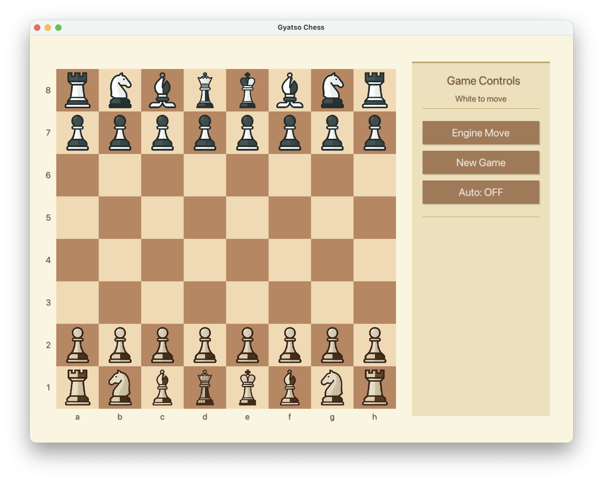

# Gyatso Chess GUI ♔

A sleek, high-performance chess GUI for [Gyatso Chess Engine](https://github.com/GyatsoYT/GyatsoChess), built with Nim and OpenGL.




## Overview

Gyatso GUI is a native cross-platform chess interface that brings the powerful [Gyatso Chess Engine](https://github.com/GyatsoYT/GyatsoChess) to life with a beautiful, responsive graphical interface. Experience tournament-level chess analysis and play with hardware-accelerated rendering and NNUE-based evaluation.

## Features

### 🎮 Interactive Gameplay
- **Drag & Drop** intuitive piece movement
- **Smooth animations** and visual feedback
- **Legal move highlighting** (coming soon)
- **Game state detection** - checkmate, stalemate, draw detection

### 🔬 Engine Integration
- **Embedded Gyatso Engine** - no external dependencies needed
- **UCI-compatible** communication protocol
- **Multi-threaded search** with channel-based architecture
- **Adjustable search depth** (default: 12 ply)
- **Time-controlled thinking** (default: 5 seconds per move)

### ⚡ Performance
- **OpenGL hardware acceleration** for smooth 60fps rendering
- **AVX2 SIMD optimizations** for NNUE inference
- **Profile-Guided Optimization (PGO)** support via compile scripts
- **LTO (Link-Time Optimization)** enabled

### 🧠 Neural Network Evaluation
- **Embedded NNUE weights** (GyatsoNet.bin) - no external files needed
- **SIMD-accelerated inference** (AVX2/AVX512)
- **Hand-Crafted Evaluation (HCE)** fallback with:
  - Piece-Square Tables (PST)
  - King safety analysis
  - Pawn structure evaluation
  - Piece mobility bonuses

### 🎵 Audio
- **Satisfying move sounds** on piece placement
- **Cross-platform audio** (afplay on macOS, aplay on Linux)

### 🎨 Visual Design
- **High-quality piece textures** (embedded PNG assets)
- **Classic chess board** with light/dark squares
- **Proper board orientation** - White always at bottom
- **Clean, minimal interface**

## Installation

### Prerequisites

- Nim compiler (2.2.4+)
- OpenGL support

### Build from Source

```bash
# Clone the repository
git clone https://github.com/GyatsoYT/gyatso_gui.git
cd gyatso_gui

# Build with nimble
nimble build -d:release

# Or build with custom config
nim c -d:release -d:avx2 src/gyatso_gui.nim
```

### Windows

Prebuilt binaries will be available in the [Releases](https://github.com/GyatsoYT/gyatso_gui/releases) section.

### macOS / Linux

```bash
# Standard build
nimble build

# Optimized build with PGO
./compile.sh  # Select Option 2 for PGO build
```

## Usage

### Running the GUI

```bash
./gyatso_gui
```

### How to Play

1. **White to move first** - click and drag pieces
2. **Play against the engine** - make your move, the engine will respond automatically
3. **Engine thinking indicator** shown in window title
4. **Valid moves only** - illegal moves are rejected

### Controls

| Action | Control |
|--------|---------|
| Move piece | Click and drag |
| Quit | Close window or Ctrl+C |

## Architecture

```
gyatso_gui/
├── src/
│   ├── gyatso_gui.nim       # Main application entry point
│   ├── gyatso_gui/
│   │   ├── board.nim        # Chess board representation & rules
│   │   ├── search.nim       # Alpha-beta search with PVS
│   │   ├── nnue.nim         # NNUE neural network evaluation
│   │   ├── hce.nim          # Hand-crafted evaluation
│   │   ├── movegen.nim      # Move generation (magic bitboards)
│   │   ├── eval.nim         # Evaluation orchestration
│   │   ├── audio.nim        # Cross-platform audio playback
│   │   └── zobrist.nim      # Zobrist hashing for TT
│   └── Net/
│       └── GyatsoNet.bin    # NNUE network weights
├── assets/
│   └── placed.mp3           # Move sound effect
└── compile.bat / compile.sh # Build scripts with PGO support
```

## Technical Highlights

### Threading Model
- **Main thread**: Handles OpenGL rendering and user input
- **Engine thread**: Runs search algorithm asynchronously
- **Channel-based communication**: Thread-safe FEN/move exchange

### Rendering Pipeline
1. **Pixie** decodes embedded PNG textures
2. **OpenGL** caches textures for GPU-accelerated rendering
3. **60 FPS** smooth animation loop

### Coordinate Systems
- **Screen coordinates**: Origin at top-left (0,0)
- **Board coordinates**: Rank 0-7 (bottom to top), File 0-7 (left to right)
- **UCI notation**: Standard algebraic notation (e.g., "e2e4")

## Dependencies

| Package | Purpose |
|---------|---------|
| `nglfw` | Window creation and input handling |
| `opengl` | OpenGL bindings for Nim |
| `pixie` | 2D graphics and PNG decoding |
| `nimsimd` | SIMD intrinsics for AVX2/AVX512 |
| `gyatso_gui` | This package (main binary) |

## Related Projects

- **[Gyatso Chess Engine](https://github.com/GyatsoYT/GyatsoChess)** - The UCI chess engine powering this GUI
  - CCRL Rating: ~3100 Elo (v1.3 estimated)
  - Principal Variation Search (PVS)
  - Advanced pruning techniques (LMR, Null Move, ProbCut)
  - Transposition tables with Zobrist hashing

- **[GyatsoBot on Lichess](https://lichess.org/@/GyatsoBot)** - Play against the engine online

## Contributing

Contributions are welcome! Please feel free to submit issues or pull requests.

1. Fork the repository
2. Create your feature branch (`git checkout -b feature/amazing-feature`)
3. Commit your changes (`git commit -m 'Add amazing feature'`)
4. Push to the branch (`git push origin feature/amazing-feature`)
5. Open a Pull Request

## Acknowledgments

- **[Gyatso Chess Engine](https://github.com/GyatsoYT/GyatsoChess)** - The powerful engine at the heart of this GUI
- **Heimdall Chess Engine** - SIMD and NNUE integration reference
- **Stockfish Dev Community** - Chess programming techniques and optimizations
- **Nim community** - Excellent language and ecosystem

## License

This project is licensed under the **GNU General Public License v3.0** - see the [LICENSE](LICENSE) file for details.

---

<p align="center">Made with ❤️ and Nim 🐉</p>
